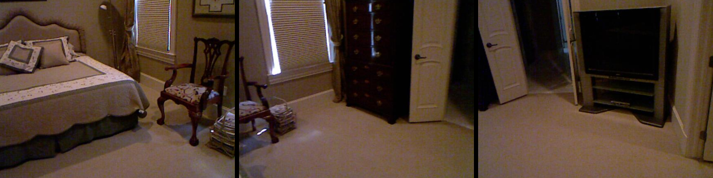
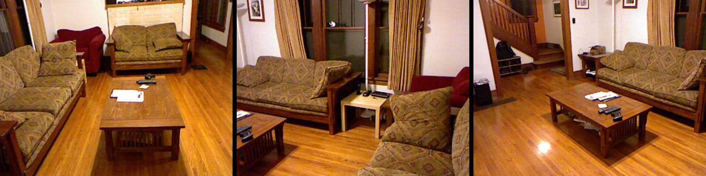

# Multi-image reasoning

## Spatial reasoning
**Question 1:** Is the chair **facing** the TV?

**Question 2:** Are the two doorless passages in the living room located on the opposite side of each other?

## Temporal Reasoning